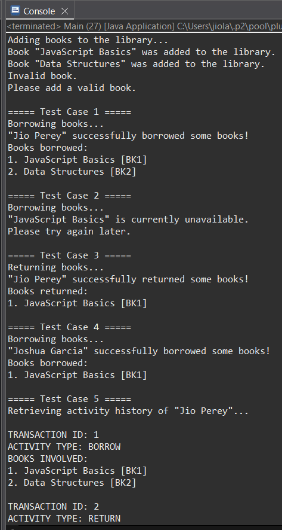
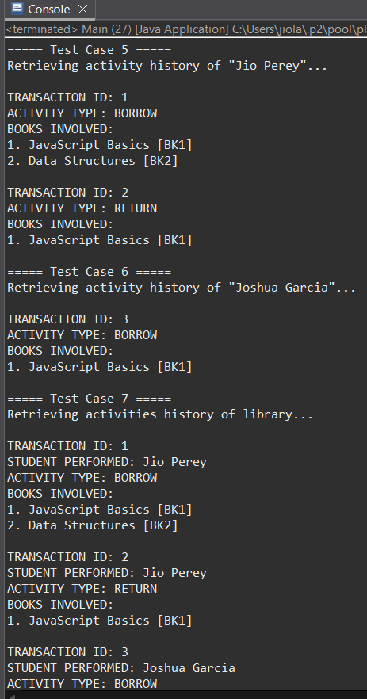
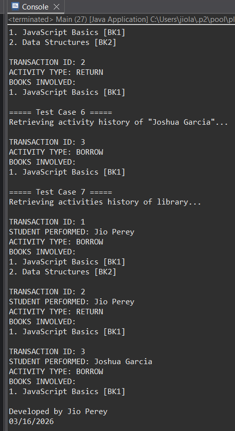

# Library Management System

<a href="https://www.jdoodle.com/ga/ILBUI6F%2BbLOi9mfJYwsH1Q%3D%3D" target="_blank">
  
</a>


Console-based library management system built using Java. Built to demostrate my understanding about Object Oriented Programming.

## Case Scenario

A school library plans to develop a Java program to manage the borrowing and returning of books by students. The system should store basic personal information about individuals who use the library, including their name and sex. Students who access library services must also have additional information recorded, such as a unique student ID and the academic program in which they are enrolled.

The library maintains a collection of books that students may borrow. Each book in the system has a book ID, title, and an availability status indicating whether the book is currently available or already borrowed. When a book is borrowed, the system must update its status so that other students cannot borrow the same book at the same time. When the book is returned, it should again become available for borrowing.

Students may perform borrowing or returning activities that involve multiple books in a single activity. For example, a student may borrow several books at once or return several books at the same time. Each activity must be recorded so that the library can track how books are used.

For every activity performed by a student, the system must create a record containing a transaction ID that is automatically generated starting from 1, the student who performed the activity, the type of activity (BORROW or RETURN), and the list of books involved in that activity.

Students may perform several activities over time, and the program must maintain all records associated with them. The system should also allow viewing the complete history of activities performed by a student, including the books involved in each activity.

## Features

- Book inventory management with availability tracking
- Student registration with academic program information
- Multi-book borrowing and returning in single transactions
- Automatic transaction ID generation
- Complete activity history for both students and library
- Input validation and error handling
- Clean separation of concerns using OOP principles

## Project Structure

```
library-management-system-oop/
├── Book.java          # Book entity with ID, title, and availability status
├── Person.java        # Base class for individuals (supports future roles)
├── Student.java       # Student class extending Person
├── Library.java       # Library management and book collection
├── Transaction.java   # Transaction records for activities
└── Main.java          # Application entry point with test cases
```

## Class Descriptions

### Book
Represents a book in the library with auto-incrementing ID, title, and availability status.

### Person
Base class containing common attributes (name, sex) for potential future roles like Librarian or Administrator.

### Student
Extends Person class. Includes student ID, academic program, and maintains a personal activity log.

### Library
Manages the book collection and maintains a complete history of all transactions.

### Transaction
Records each borrowing or returning activity with transaction ID, student, activity type, and books involved.

## How to Run

### Run It Online (No Setup Required)

**<a href="https://www.jdoodle.com/ga/ILBUI6F%2BbLOi9mfJYwsH1Q%3D%3D" target="_blank">► Click here to run the program on JDoodle</a>**

### Local Setup

1. Ensure Java JDK is installed (Java 8 or higher)
2. Clone this repository
3. Compile all Java files:
```bash
javac *.java
```
4. Run the program:
```bash
java Main
```

## Sample Output





```
Adding books to the library...
Book "JavaScript Basics" was added to the library.
Book "Data Structures" was added to the library.
Invalid book.
Please add a valid book.

===== Test Case 1 =====
Borrowing books...
"Jio Perey" successfully borrowed some books!
Books borrowed:
1. JavaScript Basics [BK1]
2. Data Structures [BK2]

===== Test Case 2 =====
Borrowing books...
"JavaScript Basics" is currently unavailable.
Please try again later.

===== Test Case 3 =====
Returning books...
"Jio Perey" successfully returned some books!
Books returned:
1. JavaScript Basics [BK1]

===== Test Case 4 =====
Borrowing books...
"Joshua Garcia" successfully borrowed some books!
Books borrowed:
1. JavaScript Basics [BK1]

===== Test Case 5 =====
Retrieving activity history of "Jio Perey"...

TRANSACTION ID: 1
ACTIVITY TYPE: BORROW
BOOKS INVOLVED: 
1. JavaScript Basics [BK1]
2. Data Structures [BK2]

TRANSACTION ID: 2
ACTIVITY TYPE: RETURN
BOOKS INVOLVED: 
1. JavaScript Basics [BK1]

===== Test Case 6 =====
Retrieving activity history of "Joshua Garcia"...

TRANSACTION ID: 3
ACTIVITY TYPE: BORROW
BOOKS INVOLVED: 
1. JavaScript Basics [BK1]

===== Test Case 7 =====
Retrieving activities history of library...

TRANSACTION ID: 1
STUDENT PERFORMED: Jio Perey
ACTIVITY TYPE: BORROW
BOOKS INVOLVED: 
1. JavaScript Basics [BK1]
2. Data Structures [BK2]

TRANSACTION ID: 2
STUDENT PERFORMED: Jio Perey
ACTIVITY TYPE: RETURN
BOOKS INVOLVED: 
1. JavaScript Basics [BK1]

TRANSACTION ID: 3
STUDENT PERFORMED: Joshua Garcia
ACTIVITY TYPE: BORROW
BOOKS INVOLVED: 
1. JavaScript Basics [BK1]

Developed by Jio Perey
03/16/2026
```

## Test Cases Covered

The program validates the following scenarios:

1. **Test Case 1**: Student successfully borrows multiple books
2. **Test Case 2**: System prevents borrowing an unavailable book
3. **Test Case 3**: Student successfully returns borrowed book
4. **Test Case 4**: Previously unavailable book can be borrowed after return
5. **Test Case 5**: Display individual student activity history
6. **Test Case 6**: Display another student's activity history
7. **Test Case 7**: Display complete library transaction history

## Key OOP Concepts Demonstrated

- **Encapsulation**: Private fields with public getters/setters
- **Inheritance**: Student extends Person class
- **Abstraction**: Clean separation between entities
- **Data Validation**: Input checking and error handling
- **Static Members**: Auto-incrementing ID tracking
- **Collections**: ArrayList for managing books and transactions

## Class Relationships
- **Person & Student** - Inheritance
- **Student & Transaction** - Association (bidirectional)
- **Transaction & Book** - Association (unidirectional)
- **Library & Book** - Aggregation
- **Library & Transaction** - Aggregation
- **Student & Book** - Dependency
- **Student & Library** - Dependency

## Technologies Used

- Java
- Object-Oriented Programming

## Author

Jio Perey  
March 16, 2026

## License

This project is open source and available for educational purposes.
